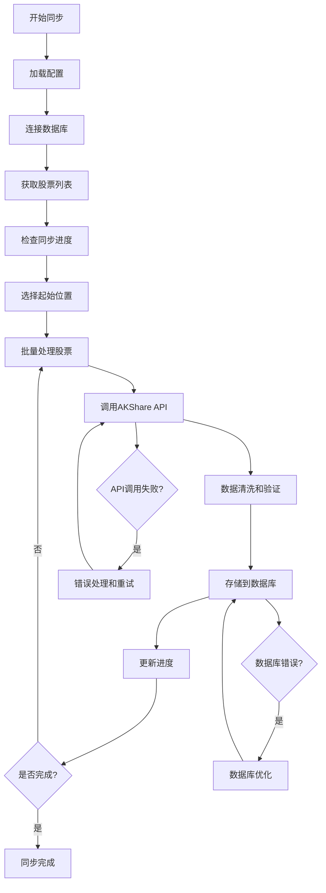
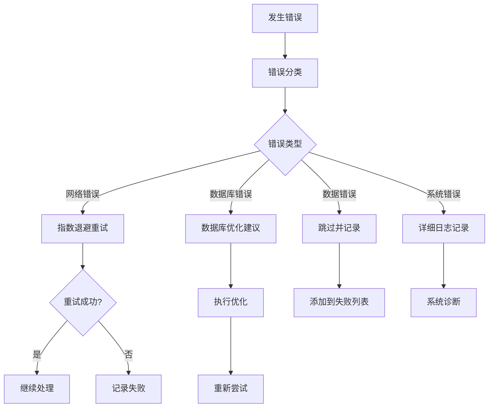

# 系统架构说明

本文档详细介绍中国股票数据同步系统的架构设计和技术实现。

## 🏗️ 整体架构

### 架构模式

系统采用**分层架构**和**MVC模式**相结合的设计：

```
┌─────────────────────────────────────────┐
│                用户界面层                │
│  (Console UI / Command Line Interface)  │
├─────────────────────────────────────────┤
│                控制器层                  │
│     (Controllers - 业务逻辑协调)         │
├─────────────────────────────────────────┤
│                服务层                    │
│    (Core Services - 核心业务逻辑)        │
├─────────────────────────────────────────┤
│                数据访问层                │
│      (Models - 数据模型和访问)           │
├─────────────────────────────────────────┤
│                数据源层                  │
│   (AKShare API / MySQL Database)        │
└─────────────────────────────────────────┘
```

### 核心组件

1. **用户界面层**: 命令行界面和交互式操作
2. **控制器层**: 协调各组件，处理用户请求
3. **服务层**: 核心同步逻辑和业务规则
4. **数据访问层**: 数据模型和数据库操作
5. **数据源层**: 外部API和数据库存储

## 📁 目录结构详解

### 核心模块 (core/)

```
core/
├── smart_stock_sync.py      # 智能同步工具（主要入口）
├── batch_sync_stocks.py     # 批量同步核心引擎
└── gentle_sync.py           # 温和同步模式
```

**职责**:
- 实现核心同步逻辑
- 提供不同的同步策略
- 处理断点续传和错误重试

### MVC架构模块

```
├── models/                  # 数据模型层
│   ├── akshare_sync_model.py   # AKShare数据模型
│   └── stock_data_model.py     # 股票数据模型
│
├── views/                   # 视图层
│   └── console_view.py         # 控制台视图
│
├── controllers/             # 控制器层
│   ├── akshare_sync_controller.py # 同步控制器
│   └── stock_controller.py     # 股票控制器
```

**职责**:
- **Models**: 数据获取、处理和存储
- **Views**: 用户界面显示和交互
- **Controllers**: 业务逻辑协调和流程控制

### 配置模块 (config/)

```
config/
├── database_config.py       # 数据库配置管理
├── sync_config.py          # 同步配置管理
└── __init__.py
```

**职责**:
- 管理数据库连接配置
- 管理同步参数配置
- 环境变量处理

### 工具模块 (utils/)

```
utils/
├── error_handler.py         # 错误处理和分类
├── logger_util.py          # 日志工具
└── __init__.py
```

**职责**:
- 统一错误处理机制
- 日志记录和管理
- 通用工具函数

## 🔧 技术栈

### 核心技术

| 技术 | 版本 | 用途 |
|------|------|------|
| Python | 3.12.10+ | 主要编程语言 |
| AKShare | Latest | 金融数据API |
| SQLAlchemy | Latest | 数据库ORM |
| MySQL | 5.7+ | 数据存储 |
| mysql-connector-python | Latest | 数据库连接器 |

### 依赖包

```python
# 核心依赖
akshare>=1.0.0              # 金融数据接口
sqlalchemy>=1.4.0           # 数据库ORM
mysql-connector-python>=8.0 # MySQL连接器
pandas>=1.3.0               # 数据处理
python-dotenv>=0.19.0       # 环境变量管理

# 可选依赖
requests>=2.25.0            # HTTP请求
numpy>=1.21.0               # 数值计算
```

## 🔄 数据流程

### 同步流程



### 错误处理流程



## 🗄️ 数据库设计

### 主要数据表

#### 1. 股票信息表 (stock_stock_info)

```sql
CREATE TABLE stock_stock_info (
    A股代码 VARCHAR(10) PRIMARY KEY,
    A股简称 VARCHAR(50),
    A股上市日期 DATE,
    -- 其他字段...
);
```

#### 2. 股票历史数据表 (stock_stock_zh_a_hist)

```sql
CREATE TABLE stock_stock_zh_a_hist (
    日期 DATE,
    股票代码 VARCHAR(10),
    开盘 DOUBLE,
    收盘 DOUBLE,
    最高 DOUBLE,
    最低 DOUBLE,
    成交量 BIGINT,
    成交额 DOUBLE,
    振幅 DOUBLE,
    涨跌幅 DOUBLE,
    涨跌额 DOUBLE,
    换手率 DOUBLE,
    PRIMARY KEY (日期, 股票代码),
    INDEX idx_stock_code (股票代码),
    INDEX idx_date (日期)
);
```

### 数据库优化

#### 索引策略

```sql
-- 主键索引（自动创建）
PRIMARY KEY (日期, 股票代码)

-- 股票代码索引
CREATE INDEX idx_stock_code ON stock_stock_zh_a_hist (股票代码);

-- 日期索引
CREATE INDEX idx_date ON stock_stock_zh_a_hist (日期);

-- 复合索引
CREATE INDEX idx_code_date ON stock_stock_zh_a_hist (股票代码, 日期);
```

#### 性能优化配置

```sql
-- InnoDB配置优化
SET GLOBAL innodb_buffer_pool_size = 2147483648;  -- 2GB
SET GLOBAL innodb_lock_wait_timeout = 300;
SET GLOBAL innodb_log_buffer_size = 67108864;     -- 64MB
SET GLOBAL innodb_flush_log_at_trx_commit = 2;
```

## 🔐 安全设计

### 配置安全

- 使用环境变量存储敏感信息
- 配置文件模板化（.env.example）
- 数据库连接加密

### 数据安全

- SQL注入防护（使用参数化查询）
- 数据验证和清洗
- 错误信息脱敏

### 访问控制

- 数据库用户权限最小化
- API调用频率限制
- 日志访问控制

## 📊 监控和日志

### 日志系统

```python
# 日志配置
logging.basicConfig(
    level=logging.INFO,
    format='%(asctime)s - %(levelname)s - %(message)s',
    handlers=[
        logging.FileHandler('logs/stock_sync.log', encoding='utf-8'),
        logging.StreamHandler()
    ]
)
```

### 监控指标

1. **同步性能**
   - 同步速度（股票/分钟）
   - 成功率
   - 错误率

2. **系统性能**
   - CPU使用率
   - 内存使用率
   - 磁盘I/O

3. **数据库性能**
   - 连接数
   - 查询响应时间
   - 锁等待时间

### 进度跟踪

```json
{
  "current_stock": "000100",
  "success_count": 1500,
  "failed_count": 5,
  "failed_stocks": [
    {
      "code": "000050",
      "name": "深天马A",
      "error": "网络超时"
    }
  ],
  "last_update": "2025-07-20T10:30:00",
  "performance": {
    "avg_time_per_stock": 2.5,
    "total_records": 1500000
  }
}
```

## 🚀 性能优化

### 数据库优化

1. **连接池管理**
   ```python
   # SQLAlchemy连接池配置
   engine = create_engine(
       connection_string,
       pool_size=20,
       max_overflow=30,
       pool_timeout=30,
       pool_recycle=3600
   )
   ```

2. **批量操作**
   ```python
   # 批量插入优化
   df.to_sql(
       table_name,
       engine,
       if_exists='append',
       index=False,
       method='multi',
       chunksize=1000
   )
   ```

### 网络优化

1. **重试机制**
   ```python
   @retry_on_error(max_retries=3, backoff_factor=2)
   def fetch_stock_data(stock_code):
       return ak.stock_zh_a_hist(symbol=stock_code)
   ```

2. **并发控制**
   ```python
   # 控制并发请求数量
   semaphore = asyncio.Semaphore(5)
   ```

### 内存优化

1. **分批处理**
   ```python
   # 分批处理大数据集
   for batch in chunked(stock_list, batch_size=100):
       process_batch(batch)
   ```

2. **资源清理**
   ```python
   # 及时释放资源
   try:
       process_data()
   finally:
       cleanup_resources()
   ```

## 🔄 扩展性设计

### 插件架构

系统支持插件扩展：

```python
class DataSourcePlugin:
    def fetch_data(self, symbol):
        raise NotImplementedError
    
    def validate_data(self, data):
        raise NotImplementedError

class AKSharePlugin(DataSourcePlugin):
    def fetch_data(self, symbol):
        return ak.stock_zh_a_hist(symbol=symbol)
```

### 配置化设计

```yaml
# sync_config.yaml
sync:
  batch_size: 10
  retry_count: 3
  timeout: 30
  
database:
  pool_size: 20
  timeout: 30
  
api:
  rate_limit: 100  # requests per minute
  timeout: 10
```

### 多数据源支持

```python
class DataSourceManager:
    def __init__(self):
        self.sources = {
            'akshare': AKSharePlugin(),
            'tushare': TuSharePlugin(),
            'wind': WindPlugin()
        }
    
    def get_data(self, source, symbol):
        return self.sources[source].fetch_data(symbol)
```

## 🧪 测试架构

### 单元测试

```python
import unittest
from unittest.mock import Mock, patch

class TestStockSync(unittest.TestCase):
    def test_fetch_stock_data(self):
        # 测试数据获取
        pass
    
    def test_data_validation(self):
        # 测试数据验证
        pass
```

### 集成测试

```python
class TestIntegration(unittest.TestCase):
    def test_full_sync_process(self):
        # 测试完整同步流程
        pass
```

### 性能测试

```python
import time
import psutil

def performance_test():
    start_time = time.time()
    start_memory = psutil.virtual_memory().used
    
    # 执行同步操作
    sync_stocks(['000001', '000002'])
    
    end_time = time.time()
    end_memory = psutil.virtual_memory().used
    
    print(f"执行时间: {end_time - start_time:.2f}秒")
    print(f"内存使用: {(end_memory - start_memory) / 1024 / 1024:.2f}MB")
```

## 📋 部署架构

### 开发环境

```bash
# 本地开发
python main.py --interactive
```

### 生产环境

```bash
# 后台运行
nohup python core/smart_stock_sync.py continue 000001 > sync.log 2>&1 &

# 使用systemd服务
sudo systemctl start stock-sync
```

### 容器化部署

```dockerfile
FROM python:3.12-slim

WORKDIR /app
COPY requirements.txt .
RUN pip install -r requirements.txt

COPY . .
CMD ["python", "core/smart_stock_sync.py", "continue", "000001"]
```

---

这个架构设计确保了系统的**可扩展性**、**可维护性**和**高性能**，为未来的功能扩展和优化提供了坚实的基础。